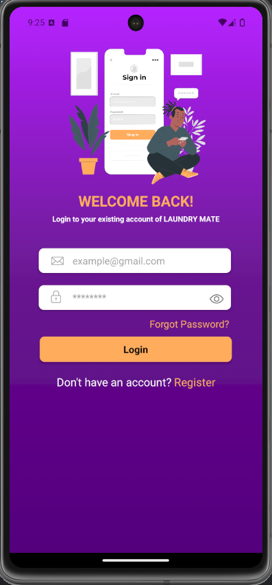
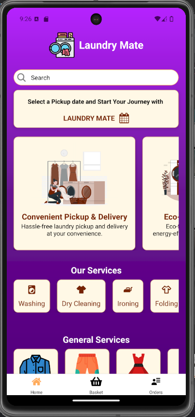
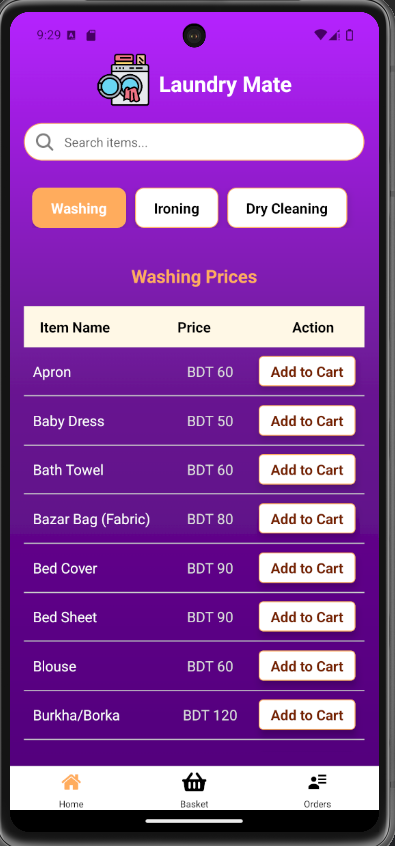
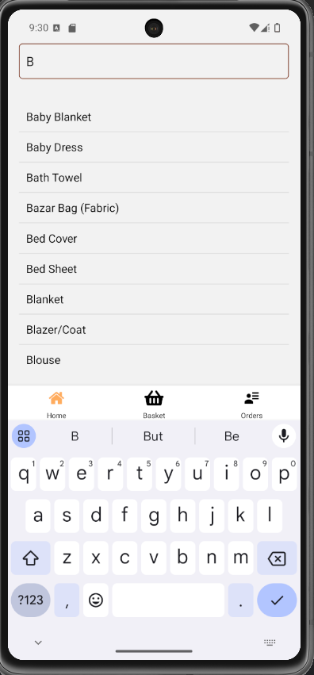
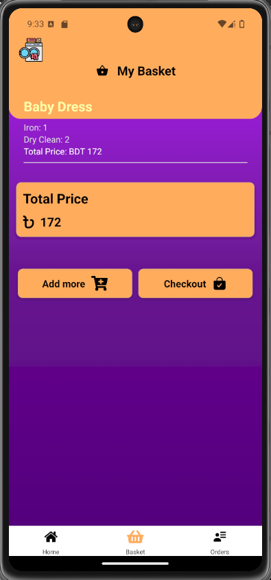
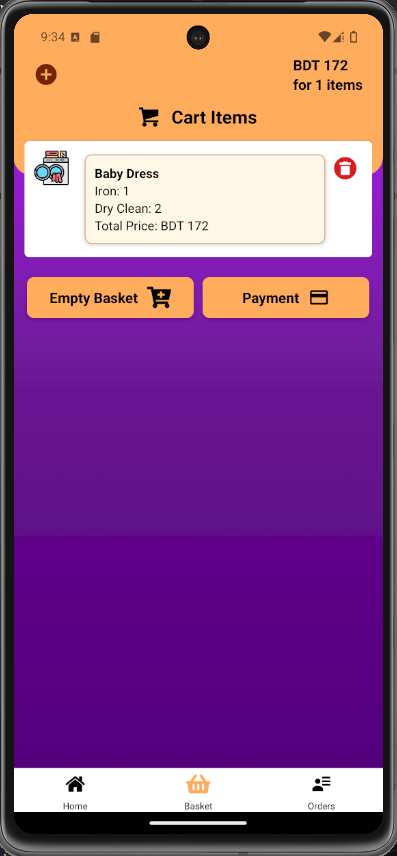
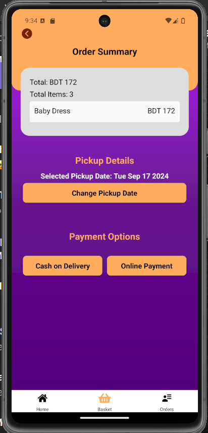
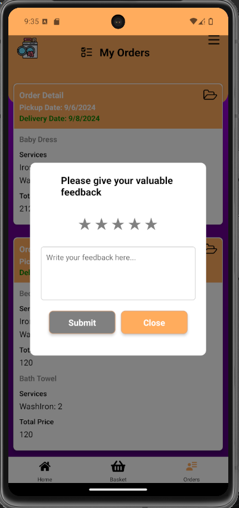

Laundry mate
A cutting-edge mobile app that transforms traditional laundry service management. Tailored to users with busy lifestyles, the app provides a seamless and efficient process for arranging laundry pick-up and delivery. The key features include:
Flexible Scheduling: Users can choose convenient time slots, eliminating the need to adjust to the provider’s schedule.
Transparent Pricing: Clear pricing structures build trust by removing uncertainties.
Efficient Service Delivery: Laundry is professionally handled and promptly returned, ensuring customer satisfaction.
LaundryMate aims to save time and offer reliable, easy-to-use laundry solutions to modern-day individuals with demanding schedules.

